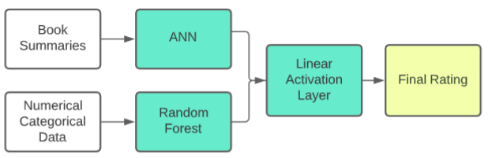
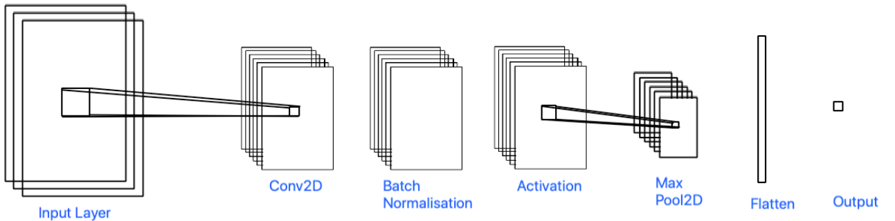
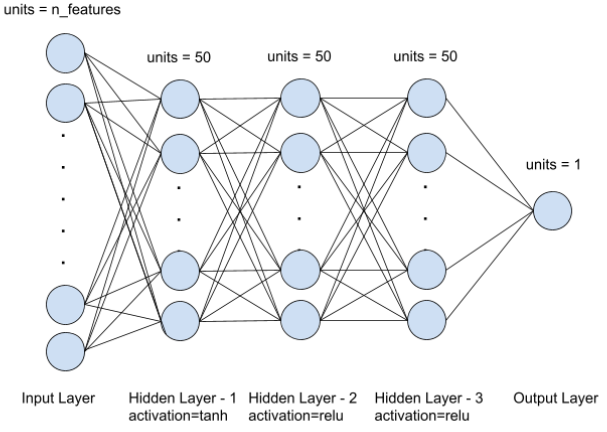
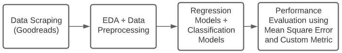

# ML-Project
ML Project code submission       

## Final Model
To run the model and reproduce the accuracy obtained by us on the test file the following command is to be run: `python3 finalModel.py`. It consists of an ensemble model of numerical data and book summary.

## Dataset
All data can be found in `/data` folder.
Original data can be downloaded from `https://drive.google.com/file/d/1MXzUW8R1dT9QdF252eqTlMPs1BSptTch/view?usp=sharing`.     
Preprocessed training data: `data/data_train.csv`     
Preprocessed testing data: `data/data_test.csv`    

## EDA
For reproducing the Exploratory Data Analysis please run `data_analysis.ipynb`

## Methodology

## Results
**Results from numerical data**      
For reproducing any results regarding models that were run on numerical data please run `rating_from_numerical_data.ipynb`. This file runs the following models on the numerical data:
* Linear regression and its variants (polynomial, regularisation, etc.)
* Naive Bayes
* Decision Trees
* SVM
* K Nearest Neighbours
* Ensemble models (bagging, adaboost, random forest, etc)
* Classification models

**Results from book cover**      
For reproducing any results regarding models that were run on book cover please run `rating_from_book_cover.ipynb`. This file runs the following models on book covers:
* ANN
* CNN

**Results from book summary**      
For reproducing any results regarding models that were run on book summary please run `rating_from_summary.ipynb`. This file runs the following models on book covers:
* ANN
* ANN + Regularisation
* Doc2Vec + Random forest
